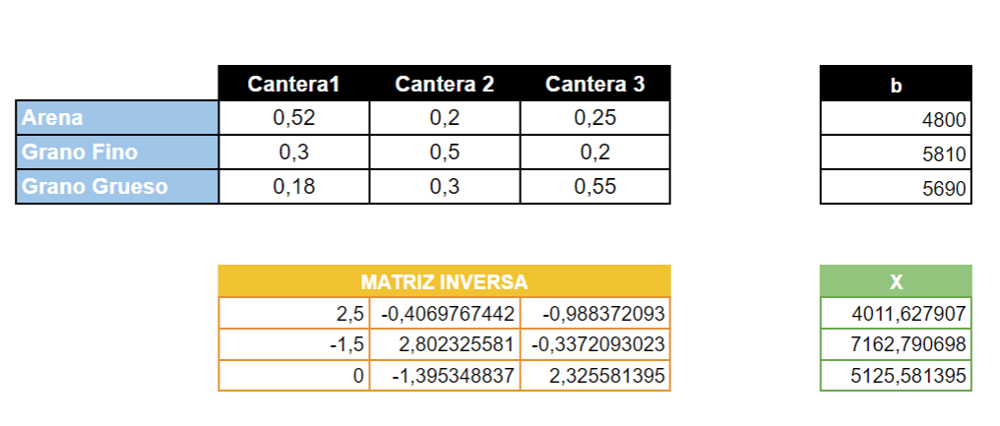

# Construcción
## Planteamiento del problema:
||Arena (%)|Grava Fina (%)|Grava Gruesa (%)|
|-|:-:|:-:|:-:|
|Cantera 1|52|30|18|
|Cantera 2|20|50|30|
|Cantera 3|25|20|55|

Un ingeniero civil requiere 4800, 5810 y 5690 metros cubicos de arena, grava fina y grava gruesa respectivamente.  
Determine la cantidad de $m^{3}$ que se debe transportar desde cada **cantera** para cumplir con su requerimiento.
## Solución:
#### Variables de decisión
$x_{1}:m^3 \text{ a extraer de la Cantera 1.}$\
$x_{2}:m^3 \text{ a extraer de la Cantera 2.}$\
$x_{3}:m^3 \text{ a extraer de la Cantera 3.}$

Así la tabla quedaría de la siguiente forma:

||Cantera1|Cantera 2|Cantera 3|
|-|:-:|:-:|:-:|
|Arena (%)|52|20|25|
|Grava Fina (%)|30|50|20|
|Grava Gruesa (%)|18|30|55|

Y el sistema asociado de la siguiente forma:

$$0.52x_1+0.20x_2+0.25x3=4800$$

$$0.30x_1+0.50x_2+0.20x3=5810$$

$$0.18x_1+0.30x_2+0.55x3=5690$$

luego, haciendo uso de algebra lineal hallamos los valores para $x_1, x_2 \text{ y } x_3$, mediante la siguiente igualdad:

$$AX=b\hspace{1cm}\text{(1)}$$

donde:

$$A = \left( \begin{matrix}
0.52 & 0.20 & 0.25 \\
0.30 & 0.50 & 0.20 \\
0.18 & 0.30 & 0.55
\end{matrix} \right )$$

$$X = \left(\begin{matrix}
x_1\\
x_2\\
x_3
\end{matrix}\right)$$

$$b = \left(\begin{matrix}
4800\\
5810\\
5690
\end{matrix}\right)$$

Y para la solución se realiza el despeje de $X$, entonces la ecuación (1) qudaría de la siguiente forma:

$$X=A^{-1}b\hspace{1cm}\text{(2)}$$

### Solucion en Excel:
Mediante el uso de la funcion **MINVERSA(:)** hallamos la inversa de la matriz A y con la función **MMULT(: ; :)** realizamos el producto de las matrices $A^{-1}$ y $b$. El resultado sería el siguinete:



### Solucion en Python:

Haciendo uso de la biblioteca **numpy** de **python** se hallara la matriz X.
primeramente importamos la biblioteca **numpy** con la siguiente linea de código:
```{python, collapse = TRUE, echo = FALSE}
import numpy as np
```
Luego se crean las matrices $A$ y $b$ con la función **array()** de la biblioteca **numpy**:
```{python, collapse = TRUE, echo = FALSE}
A = np.array([
    [0.52, 0.20, 0.25],
    [0.30, 0.50, 0.20],
    [0.18, 0.30, 0.55]
])

b = np.array([[4800],
             [5810],
             [5690]
             ])

```
Luego hallamos la inversa de la matriz $A$ con la función **linalg.inv()**
```{python, collapse = TRUE, echo = FALSE}
A_inv = np.linalg.inv(A)
```
Y finalmente se realiza la multiplicación de las Matrices $A^{-1}$ y $b$ con ayuda de la función **dot()**, que realizara el **producto escalar** o **producto punto** de las matrices $A^{-1}$ y $b$.
```{python, collapse = TRUE, echo = FALSE}
X = np.dot(A_inv, b)
```
Y la solucion sería:
```{python, collapse = TRUE, echo = FALSE}
        MATRIZ INVERSA
[[ 2.50000000e+00 -4.06976744e-01 -9.88372093e-01]
 [-1.50000000e+00  2.80232558e+00 -3.37209302e-01]
 [ 4.76661048e-17 -1.39534884e+00  2.32558140e+00]]

        MATRIZ X (SOLUCIÓN)
[[4011.62790698]
 [7162.79069767]
 [5125.58139535]]
```

## Interpretación de los resultados
Para cumplir con los requerimientos del Ingeniero, cada cantera debe extraer las siguientes cantidades en $m^3$ de materia prima:

* **Cantera 1**: Debe extraer aproximadamente 4011.63 $m^3$ de materia prima, del cual se obtendrá un 52% de arena, 30% de grava fina y 18% de grava gruesa.

* **Cantera 2**: Debe extraer aproximadamente 7160.79 $m^3$ de materia prima, del cual se obtendrá un 20% de arena, 50% de grava fina y 30% de grava gruesa.

* **Cantera 3**: Debe extraer aproximadamente 5125.58 $m^3$ de materia prima, del cual se obtendrá un 25% de arena, 20% de grava fina y 55% de grava gruesa.
