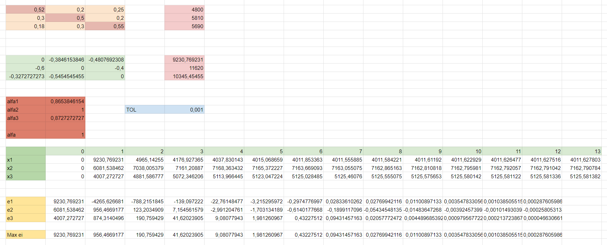

# Método Iterativo Gauss-Siedel

Se resolvera el siguiente sistema (Problema planteado en el Desafio 1) mediante la tecnica itertiva de Gauss-Siedel.

$$0.52x_1+0.20x_2+0.25x3=4800$$

$$0.30x_1+0.50x_2+0.20x3=5810$$

$$0.18x_1+0.30x_2+0.55x3=5690$$

donde:

$x_{1}:m^3 \text{ a extraer de la Cantera 1.}$\
$x_{2}:m^3 \text{ a extraer de la Cantera 2.}$\
$x_{3}:m^3 \text{ a extraer de la Cantera 3.}$
## Implementación en Python
**ENTRADA:**

Ingresar los siguientes valores en el archivo **datos.in**.
* El número de ecuaciones y valores desconocidos **$n$**.
* Las entradas $a_{ij},\text{ }1≤i, j≤n$
 de la matriz **$A$**.
* Las entradas $b_i,\text{ }1≤i≤n$ de **$b$**.
* tolerancia **$TOL$**.
* Número máíximo de iteraciones **$N$**.

    **Ejemplo:** ingresar los valores de entrada en el archivo **datos.in** tal y como se muestra a continuación:
    ```{python, collapse = TRUE, echo=FALSE}
    3
    0.52 0.20 0.25
    0.30 0.50 0.20
    0.18 0.30 0.55
    4800 5810 5690
    0.001
    1000
    ```
### Salida en pantalla
Con una tolerancia de **0.001** se obtiene los siguientes resultados.
```{python, collapse = TRUE, echo = FALSE}
Matriz: 3x3

Matriz A:
[0.52, 0.2, 0.25]
[0.3, 0.5, 0.2]
[0.18, 0.3, 0.55]

Vector b: [4800.0, 5810.0, 5690.0]

Vector X0: [0, 0, 0]

Tolerancia: 0.001

Número Máximo de Iteraciones: 1000

SOLUCIÓN:
Xi = [4011.6278032988193, 7162.790783738721, 5125.581382335629]
Iteraciones = 13
```
## Implementación en Excel

## Comparacion de resultados

||$X$ Real|$X^{(k)}$ Jacobi|$X^{(k)}$ Gauss-Siedel|
|:-:|:-:|:-:|:-:|
|$x_1$|4011.62790698|4011.627498239788|4011.6278032988193|
|$x_2$|7162.79069767|7162.790246973516|7162.790783738721|
|$x_3$|5125.58139535|5125.580979616491|5125.581382335629|
|$Tolerancia$||0.001|0.001|
|$Iteraciones$||180|13|
|$E_r=\frac{\left\| X - X^{k} \right\|}{\left\| X \right\|}$||$7.6\text{x}10^{-08}$|$1.4\text{x}10^{-08}$|

## Conclusión:
En vista de los resultados se puede observar que el algoritmo de Gauss-Siedel es más eficiente ya que este en comparación con el algoritmo de Jacobi tomo aproximadamente 14 veces menos iteraciones para este problema, y mas eficaz ya que el error relativo es menor en comparación con el algoritmo de Jacobi.

## Referencias
Richard L. Burden (2016). ANÁLISIS NUMÉRICO (10ma ed.). (p. 339).
