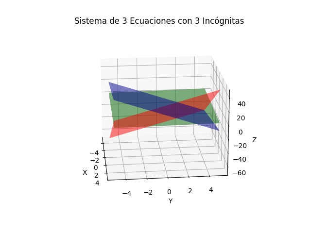

# Solución de un sistema de ecuaciones mediante Factorización LU

## Problema 10.3


### Solución
#### Excel


#### Captura de la solución en Octave con LU
```{octave}
A = [8, 4, -1; -2, 5, 1; 2, -1, 6]
b = [11; 4; 7]
[L, U] = lu(A)
d = inv(L)*b
x = inv(U) * d
```
##### Salida en pantalla
```{octave}

A =

   8   4  -1
  -2   5   1
   2  -1   6

b =

   11
    4
    7

L =

   1.0000        0        0
  -0.2500   1.0000        0
   0.2500  -0.3333   1.0000

U =

   8.0000   4.0000  -1.0000
        0   6.0000   0.7500
        0        0   6.5000

d =

   11.0000
    6.7500
    6.5000

x =

   1
   1
   1
```

#### Gráfica en 3D Captura y Código en Python


```{python}
import numpy as np
import matplotlib.pyplot as plt
from mpl_toolkits.mplot3d import Axes3D

# Definir las ecuaciones
def eq1(x, y):
    return (-11 + 8 * x + 4 * y)  # x3 = -11 - 8x1 + 4x2

def eq2(x, y):
    return (4 + 2 * x - 5 * y)  # x3 = 4 + 2x1 - 5x2

def eq3(x, y):
    return (7/6 - 2/6 * x + 1/6 * y)      # x3 = 7/6 - 2/6x1 + 1/6x2

# Crear un rango de valores para x y y
x = np.linspace(-5, 5, 100)
y = np.linspace(-5, 5, 100)
x, y = np.meshgrid(x, y)

# Calcular z para cada ecuación
z1 = eq1(x, y)
z2 = eq2(x, y)
z3 = eq3(x, y)

# Crear la figura y los ejes 3D
fig = plt.figure()
ax = fig.add_subplot(111, projection='3d')

# Graficar las superficies
ax.plot_surface(x, y, z1, alpha=0.5, rstride=100, cstride=100, color='red', label='Ecuación 1')
ax.plot_surface(x, y, z2, alpha=0.5, rstride=100, cstride=100, color='blue', label='Ecuación 2')
ax.plot_surface(x, y, z3, alpha=0.5, rstride=100, cstride=100, color='green', label='Ecuación 3')

# Configurar etiquetas y título
ax.set_xlabel('X')
ax.set_ylabel('Y')
ax.set_zlabel('Z')
ax.set_title('Sistema de 3 Ecuaciones con 3 Incógnitas')

# Mostrar la gráfica
plt.show()
```