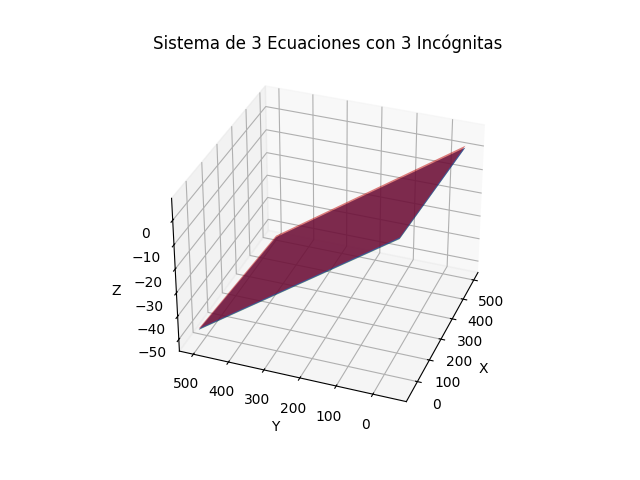
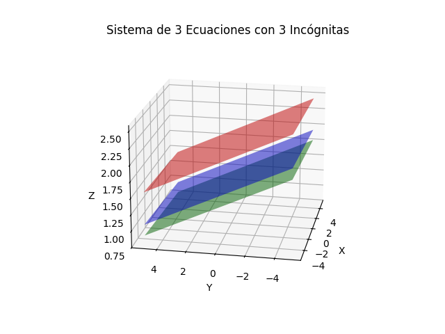

# SISTEMA MAL CONDICIONADO DE 3X3 CON GRÁFICO

## Plantear un ejemplo

$$x_1 + 10.01x_2 + 100x_3 = 200$$

$$2.12x_1 + 20x_2 + 200x_3 = 300$$

$$3.1x_1 + 30x_2 + 300x_3 = 400$$

## Explicación y pruebas

### Determinante
Si el determinante es cero o muy cercano a cero, el sistema está mal condicionado, lo que implica que las soluciones pueden ser inestables.

Del ejemplo planteado se tiene:
$$A = \begin{bmatrix}
1 & 10.01 & 100 \\
2.12 & 20 & 200 \\
3.1 & 30 & 300
\end{bmatrix}$$

Con ayuda de la función **det()** de **Octave**
se obtiene el siguiente resultado.
```{octave}
A =

     1.0000    10.0100   100.0000
     2.1200    20.0000   200.0000
     3.1000    30.0000   300.0000

det(A)

ans = -0.1600
```
Vemos que el determinante calculado es proximo a $0$, lo que muestra que existe una gran probabilidad de que el sistema este mal condicionado, pero dicha conclusión es un poco ambigua ya que no nos indican cuán cercano a cero debe estar el determinante calculado, por lo que se procedera a calcular el numero de condición o condicional.

### Condicional

El número de condición $\kappa(A)$ se define como:

$$κ(A)=∥A∥⋅∥A^{−1}∥$$

Si el número de condición es muy grande, el sistema esta mal condicionado.

Con ayuda de la función **cond()** de **Octave**
se obtiene el siguiente resultado.
```{octave}
A = [
    1, 10.01, 100;
    2.12, 20, 200;
    3.1, 30, 300
    ]

cond(A)

ans = 5.3131e+04
```

Donde se observa que el resultado $5313.1$ es muy grande, por lo tanto se confirma el mal condicionamiento del sistema.

### Pequeños cambios cambian radicalmente la solución

Realizando un cambio en el elemento $a_{11} = 1$ de la matriz $A$ por $\tilde{a}_{11} = 0.9$, se obtiene la matriz modificada $\tilde{A}$.

entonces, se tiene:

$$A = \begin{bmatrix}
1 & 10.01 & 100 \\
2.12 & 20 & 200 \\
3.1 & 30 & 300
\end{bmatrix} \text{;}\hspace{1cm} \tilde{A} = \begin{bmatrix}
0.9 & 10.01 & 100 \\
2.12 & 20 & 200 \\
3.1 & 30 & 300
\end{bmatrix}$$

Con ayuda de **Octave** obtenemos los siguientes resultados:
```{octave}
A = [
    1, 10.01, 100;
    2.12, 20, 200;
    3.1, 30, 300
    ]
b = [200; 300; 400]

A1 = [
    0.9, 10.01, 100;
    2.12, 20, 200;
    3.1, 30, 300
    ]

b1 = [200; 300; 400]

x = inv(A)*b
x1 = inv(A1)*b1
```
Solución:
```{octave}
x =

    625.00
   8750.00
   -880.13

x1 =

   6.2500e+02
   1.5000e+04
  -1.5051e+03
```
Se puede observar que con tan solo cambiar un decimal en uno de los coeficientes del sistema, se genera un gran impacto en los resultados.

### Matriz identidad
Con ayuda de la bibilioteca **Numpy** de **Python** se obtiene el siguiente resultado:

```{python}
import numpy as np

A = np.array([
        [1, 10.01, 100],
        [2.12, 20, 200],
        [3.1, 30, 300]
        ])

A_inv = np.linalg.inv(A)
I = np.dot(A, A_inv)

print(I)
```
Resultado
```{python}
[[ 1.00000000e+00  6.39488462e-14 -7.10542736e-14]
 [ 0.00000000e+00  1.00000000e+00 -1.42108547e-13]
 [ 0.00000000e+00  7.81597009e-14  1.00000000e+00]]
```

Los valores no satisfacen las condiciones que debe cumplir una matriz identidad, que son:

* La diagonal principal de la matriz esta compuesta por unos.
* Los valores fuera de la diagonal principal de la matriz, deben ser cero.

### Gráfico

Graficando el siguiente sistema:

$$x_1 + 10.01x_2 + 100x_3 = 200$$

$$2.12x_1 + 20x_2 + 200x_3 = 300$$

$$3.1x_1 + 30x_2 + 300x_3 = 400$$

despejando $x_3$, se tiene:
$$x_3 = \frac{200}{100} - \frac{1}{100}x_1 - \frac{10.01}{100}x_2$$

$$x_3 = \frac{300}{200} - \frac{2.12}{200}x_1 - \frac{20}{200}x_2$$

$$x_3 = \frac{400}{300} - \frac{3.1}{300}x_1 - \frac{30}{300}x_2$$

con ayuda de **Python** se obtiene el siguiente gráfico en 3 dimensiones del sistema descrito:



Realizando un acercamiento al gráfico se observa que los planos podrían ser paralelos, lo que significaría que el sistema podría contar con infinitas soluciones.



## Conclusion:
Los sistemas mal condicionados presentan problemas cuando se encuentran durante la solución númerica de ecuciones lineales, lo cual se debe a que este tipo de sistemas son extremadamente sensibles a los errores de redondeo.

## Referencias

* Richard L. Burden (2016). ANÁLISIS NUMÉRICO (10ma ed.). (p. 296).

* Steven C. Chapra (2015). MÉTODOS NUMÉRICOS (7ma ed.). (p. 230).

* Sistemas mal condicionados: https://www.youtube.com/watch?v=xuXx6ITk-T8
